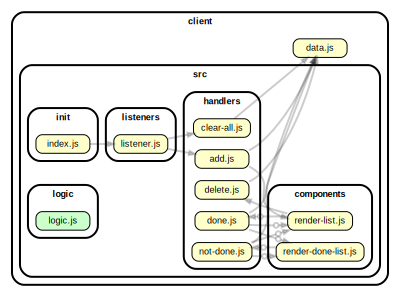

<!-- BEGIN TITLE -->

# DOCS

<!-- END TITLE -->

<!-- BEGIN TREE -->

> [interactive graph](./dependency-graph.html)



<!-- END TREE -->

<!-- BEGIN TOC -->

- public
- src
  - components
    - [render-done-list.js](#clientsrccomponentsrender-done-listjs)
    - [render-list.js](#clientsrccomponentsrender-listjs)
  - handlers
    - [add.js](#clientsrchandlersaddjs)
    - [clear-all.js](#clientsrchandlersclear-alljs)
    - [delete.js](#clientsrchandlersdeletejs)
    - [done.js](#clientsrchandlersdonejs)
    - [not-done.js](#clientsrchandlersnot-donejs)
  - init
    - [index.js](#clientsrcinitindexjs)
  - listeners
    - [listener.js](#clientsrclistenerslistenerjs)
  - logic
    - [logic.js](#clientsrclogiclogicjs)
- styles
- [data.js](#clientdatajs)

---

<!-- END TOC -->

<!-- BEGIN DOCS -->

# /public

---

# /src

## /components

<details><summary><a href="../../client/src/components/render-done-list.js" id="clientsrccomponentsrender-done-listjs">../client/src/components/render-done-list.js</a></summary>

</details>

<details><summary><a href="../../client/src/components/render-list.js" id="clientsrccomponentsrender-listjs">../client/src/components/render-list.js</a></summary>

<a name="renderList"></a>

## renderList ⇒ <code>Object</code>

This function takes the elements stored in an array of strings and creates an un-ordered list where each list element is one of the elements in the given array.

**Returns**: <code>Object</code> - ulEl - DOM <ul> element containing all the listed items.

| Param           | Type               | Description                                                |
| --------------- | ------------------ | ---------------------------------------------------------- |
| arrayOfElements | <code>Array</code> | Array whose elements will be listed in an un-ordered list. |

**Example**

```js
elements = [element1, element2, element3, element4, element5]

<ul>
 <li>element1</>
 <li>element2</>
 <li>element3</>
 <li>element4</>
 <li>element5</>
</ul>
```

</details>

---

## /handlers

<details><summary><a href="../../client/src/handlers/add.js" id="clientsrchandlersaddjs">../client/src/handlers/add.js</a></summary>

</details>

<details><summary><a href="../../client/src/handlers/clear-all.js" id="clientsrchandlersclear-alljs">../client/src/handlers/clear-all.js</a></summary>

</details>

<details><summary><a href="../../client/src/handlers/delete.js" id="clientsrchandlersdeletejs">../client/src/handlers/delete.js</a></summary>

<a name="deleteElementHandler"></a>

## deleteElementHandler

| Param | Description                       |
| ----- | --------------------------------- |
| event | Click event of the Delete button. |

</details>

<details><summary><a href="../../client/src/handlers/done.js" id="clientsrchandlersdonejs">../client/src/handlers/done.js</a></summary>

<a name="doneElementHandler"></a>

## doneElementHandler

</details>

<details><summary><a href="../../client/src/handlers/not-done.js" id="clientsrchandlersnot-donejs">../client/src/handlers/not-done.js</a></summary>

<a name="notDoneElementHandler"></a>

## notDoneElementHandler

</details>

---

## /init

<details><summary><a href="../../client/src/init/index.js" id="clientsrcinitindexjs">../client/src/init/index.js</a></summary>

</details>

---

## /listeners

<details><summary><a href="../../client/src/listeners/listener.js" id="clientsrclistenerslistenerjs">../client/src/listeners/listener.js</a></summary>

</details>

---

## /logic

<details><summary><a href="../../client/src/logic/logic.js" id="clientsrclogiclogicjs">../client/src/logic/logic.js</a></summary>

</details>

---

---

# /styles

---

<details><summary><a href="../../client/data.js" id="clientdatajs">../client/data.js</a></summary>

</details>

<!-- END DOCS -->
